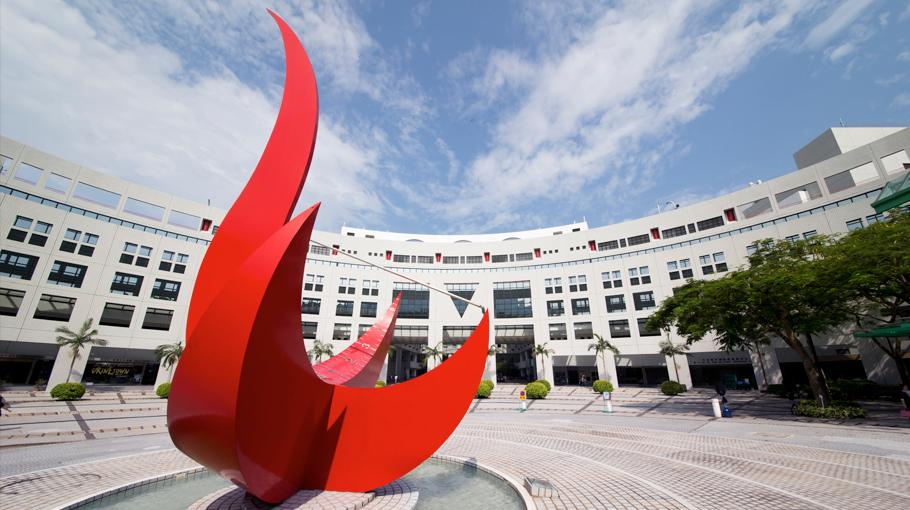

# HKUST Internet Research Workshop (HKIRW) 2025

## Workshop on Future Internet Research Directions

Mar 13, 2025  
Room 5562 (Lift 27/28), HKUST, Clear Water Bay campus  
[http://hkirw.github.io/2025](http://hkirw.github.io/2025)

Built on the huge success of the [HKIRW 2024](http://hkirw.github.io/2024), in the week before the [IETF-122 meeting in Bangkok](https://www.ietf.org/how/meetings/122/), this workshop aims to bring together researchers in computer networking and systems around the globe to a live forum discussing innovative ideas at their early stages. 
The mission of the workshop is that promising but not-yet-mature ideas can receive timely feedback from the community and experienced researchers, leading them into future IRTF work, Internet Drafts, or IETF working groups.

The workshop will operate like a “one day [Dagstuhl](https://www.dagstuhl.de/) seminar” and will focus on discussion and ideas exchange and less on conference-style presentations. The objective is to identify topics and connect like-minded people for potential future collaboration.

## Topics of Interest

Topics can be anything related to Internet research, but are expected be controversial – that’s the purpose of this workshop\!.

## How to Contribute

We extremely welcome suggestions for a discussion topic and/or a lightning talk. Please contact the organizers (see below).

## Program Outline

| Time (UTC+8) | Event |
| :---- | :---- |
| **10:00 – 10:10** | **Welcome Remarks** *by Dirk Kutscher and Zili Meng (HKUST)* |
| **10:10 – 11:10** | A Detailed Measurement View on IPv6 Scanners and Their Adaptation to BGP Signals *by Thomas Schmidt* |
| **11:10 – 11:40** | **Coffee Break** |
| **11:40 – 12:40** | How will new/emerging photonics change approaches to protocol design *by Dave Oran* |
| **12:40 – 14:30** | **Lunch** [UniBistros & Bars](https://www.conferencelodge.hk/en/food-beverage/unibistroandbar.html) |
| **14:30 – 15:30** | Simulating ML Training Workloads *by Jianfei He* |
| **15:30 – 16:00** | **Coffee Break** |
| **16:00 – 17:00** | Network Research: Academia, Industry, or Both? *by Zili Meng* |
| **17:00 – 17:10** | **Wrap-Up** Chairs: Dirk Kutscher and Zili Meng (HKUST) |
| **18:00 – 21:00** | **Dinner Banquet** |

## Register

Please [register here](https://forms.gle/65X2dLbgPXnA4ciC8).

If you need an invitation letter, please contact [zilim@ust.hk](mailto:zilim@ust.hk).  

## Hotel Information

- Crowne Plaza Hong Kong Kowloon East ([website](https://www.ihg.com/crowneplaza/hotels/us/en/hong-kong/hkgtk/hoteldetail))  
  - Tower 5, No. 3 Tong Tak Street, Tseung Kwan O, Hong Kong, (852) 3983 0388  
- Vega Suites ([www.vegasuites.com.hk](https://www.vegasuites.com.hk/))  
  - 3 Tong Tak Street, Tseung Kwan O, Hong Kong, (852) 3963 7888

## Local Transportation

Uber is the most convenient tool for visitors in Hong Kong.

From Hong Kong International Airport to Tseung Kwan O (the nearest neighborhood of HKUST).

- By Taxi: Approximately 45 minutes, HKD $400, cash only or Uber.  
- By Bus Line A29: Approximately 70 minutes, HKD $50, see the [website](https://www.hongkong.net/transportation/to-from-airport/bus/a29).

From Tseung Kwan O to HKUST.

- By Taxi: Approximately 15 minutes, HKD $60, cash only or Uber.  
- By Bus Line 792M: Approximately 25 minutes, HKD $7.9, see the [website](https://hkbus.app/en/route/792m-1-tseung-kwan-o-station-sai-kung).

## Organizers

* Prof. [Dirk Kutscher](https://dirk-kutscher.info/), HKUST(GZ), [dku@hkust-gz.edu.cn](mailto:dku@hkust-gz.edu.cn)   
* Prof. [Zili Meng](https://zilimeng.com/), HKUST, [zilim@ust.hk](mailto:zilim@ust.hk) 
